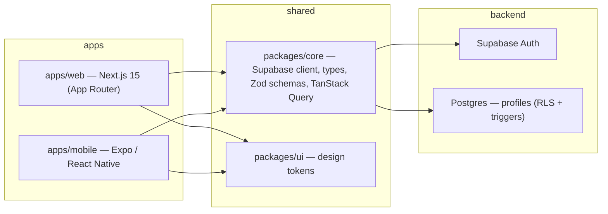

# skinsavior

> Your skin, finally explained. A cross-platform skincare app that turns a short skin quiz into personalized, evidence-graded product guidance — built as a typed monorepo sharing one codebase across web and mobile.

**[🌐 Live demo](https://project-ss-web.vercel.app/)**

<!-- Once CI is set up, add the badge here:
[](https://github.com/aagh-jr/skinsavior/actions/workflows/ci.yml)
-->

[](https://project-ss-web.vercel.app/)


<!-- TODO: add a screenshot or GIF here — it's the single highest-impact thing you can add.

-->

## What it does

skinsavior helps people understand skincare products instead of guessing in the beauty aisle:

- A multi-step **skin quiz** captures skin type, concerns, goals, sensitivity, and budget.
- The answers are saved to a per-user **profile** (authenticated, row-level secured).
- Product pages present an **evidence grade**, ingredient breakdown, safety flags, and a personalized "for you" view.
- Browse by **products, ingredients, routines, and community**, with global search.

## Architecture

A single **Turborepo** monorepo shares typed domain logic across a Next.js web app and an Expo mobile app, both backed by Supabase.



## Tech stack

| Layer        | Tech |
|--------------|------|
| Monorepo     | Bun workspaces, Turborepo, TypeScript |
| Web          | Next.js 15 (App Router), React 19, Tailwind CSS v4, Radix UI / shadcn-style components, TanStack Query, React Hook Form + Zod |
| Mobile       | Expo 54, Expo Router, React Native 0.81, NativeWind, Reanimated |
| Shared       | `@skinsavior/core` (typed Supabase client, Zod schemas, domain types, query client), `@skinsavior/ui` (design tokens) |
| Backend      | Supabase — Postgres, Auth, Row-Level Security, SQL migrations, trigger functions |
| Tooling      | ESLint 9, Prettier 3, `tsc` typechecking via Turbo pipelines |

## Project structure

```
skinsavior/
├─ apps/
│  ├─ web/        # Next.js 15 app (App Router)
│  └─ mobile/     # Expo / React Native app
├─ packages/
│  ├─ core/       # Shared Supabase client, types, Zod schemas, query client
│  └─ ui/         # Shared design tokens
├─ supabase/      # SQL migrations, config
└─ turbo.json     # Turborepo task pipeline
```

## Getting started

### Prerequisites
- [Bun](https://bun.sh) `>= 1.3`
- A [Supabase](https://supabase.com) project (free tier is fine)

### Setup

```bash
# 1. Install dependencies (from the repo root)
bun install

# 2. Configure environment variables
cp apps/web/.env.example apps/web/.env.local
cp apps/mobile/.env.example apps/mobile/.env
# then fill in your Supabase URL + anon key in each

# 3. Apply the database schema to your Supabase project
#    (run the SQL in supabase/migrations/ via the Supabase dashboard or CLI)

# 4. Start everything
bun run dev
```

The web app runs at http://localhost:3000.

### Useful scripts (run from root)

| Command | Description |
|---------|-------------|
| `bun run dev`       | Start all apps in dev mode (Turbo) |
| `bun run build`     | Build all apps |
| `bun run lint`      | Lint all packages |
| `bun run typecheck` | Type-check all packages |
| `bun run format`    | Format with Prettier |

### Syncing the database schema

The live Supabase database is the source of truth. When tables are added or
changed there (e.g. via the Supabase dashboard), pull those changes back into
the repo so the shared types and migrations stay in sync.

```bash
# One-time: link this repo to the Supabase project (run from the repo root).
# Prompts for the project's database password (Dashboard → Project Settings → Database).
npx supabase login
npx supabase link --project-ref vltvclhxrjroecjnugpu

# Regenerate the typed schema from the live database (no Docker needed).
# This is the important one — it keeps packages/core types matching the real tables.
npx supabase gen types typescript --linked > packages/core/src/supabase/types.ts

# Optional: pull the full schema into a new SQL migration.
# Requires Docker Desktop running (it uses a local shadow database).
npx supabase db pull
```

> If `db pull` complains that the migration history doesn't match, run the
> `supabase migration repair --status applied <id>` commands it suggests — that
> only updates the tracking table, it does not touch your data.

## Status & roadmap

This is an active portfolio project. **Current** vs. **planned** is kept honest below:

**Built**
- [x] Turborepo monorepo with shared `core` / `ui` packages
- [x] Next.js 15 web app (9 routes) + Expo mobile app
- [x] Supabase Auth + Postgres with RLS policies and trigger functions
- [x] End-to-end skin quiz → authenticated profile persistence
- [x] Product / ingredient / routine / community browsing with global search

**Planned (not yet implemented)**
- [ ] RAG-based ingredient analysis with Claude (currently a typed stub + static data)
- [ ] URL product-profile builder (paste a product URL → structured profile)
- [ ] Product database + vector search (pgvector) to replace the static demo catalog
- [ ] Test suite (Vitest + Playwright) and CI

> Product data is currently static demo content; match scores and AI analysis are illustrative until the pipeline above lands.

## License

The **source code** is licensed under the [MIT License](LICENSE) © 2026 Abel Gonzalez.

The **brand and visual assets** are **not** covered by the MIT license and are
reserved, All Rights Reserved — including the "skinsavior" name, logo/icons, and
any original illustrations, graphics, or imagery in this repository. If you reuse
the code, replace these with your own. See the [LICENSE](LICENSE) for details.
